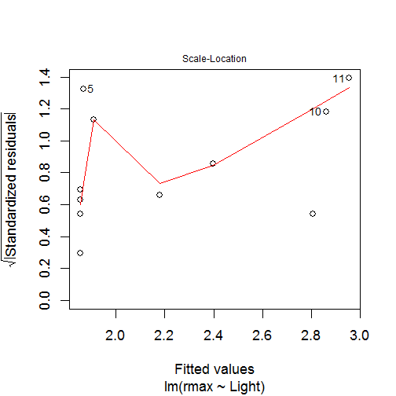

Lab 1 - Ecology
========================================================


```r
setwd("C:/Users/Alexandre/Documents/Ale/Dr/PHD/Courses/EEB1320 Ecology/Labs/01_Lab")

2 + 2
```

```
## [1] 4
```

```r
a = 2 + 2

a = 3 * (4 + 5)

x = 5
y = 2
z1 = x * y
z2 = x/y
z3 = x^y
z2
```

```
## [1] 2.5
```

```r
z3
```

```
## [1] 25
```

```r
z3 = 2 * x^y
A = 3
C = (A + 2 * sqrt(A))/(A + 5 * sqrt(A))
C
```

```
## [1] 0.5544
```

```r
C = A + 2 * sqrt(A)/A + 5 * sqrt(A)
```

### Exercise 2.1

#### Ex.1


```r
num.1 <- (2^7)/((2^7) - 1)
num.2 <- (1 - (1/(2^7)))^-1
if (num.1 == num.2) "equal"
```

```
## [1] "equal"
```

```r
if (num.1 != num.2) "different"
```


#### Ex.2

```r
n <- 0.2
1 + n
```

```
## [1] 1.2
```

```r
1 + n + (n^2)/2
```

```
## [1] 1.22
```

```r
1 + n + (n^2)/2 + (n^3)/6
```

```
## [1] 1.221
```

```r
1 + n + (n^2)/2 + (n^3)/6 + (n^4)/8
```

```
## [1] 1.222
```

```r
1 + n + (n^2)/2 + (n^3)/6 + (n^4)/8 + (n^5)/10
```

```
## [1] 1.222
```

```r

exp(1)^n
```

```
## [1] 1.221
```


#### What is the point of this exercise?
#### To better understand the exp() funcion in R

#### Ex. 3

```r
bell <- function(x) {
    ((1/sqrt(2 * pi)) * exp(1)^((-x^2)/2))
}
bell(1)
```

```
## [1] 0.242
```

```r
bell(2)
```

```
## [1] 0.05399
```

```r

if (bell(1) == dnorm(1)) "correct"
```

```
## [1] "correct"
```

```r
if (bell(1) != dnorm(1)) "incorrect"

if (bell(2) == dnorm(2)) "correct"
```

```
## [1] "correct"
```

```r
if (bell(2) != dnorm(2)) "incorrect"
```


### Exercise 3.1

```r
apropos("sin")
```

```
##  [1] ".__C__missing"       "as.single"           "as.single.default"  
##  [4] "asin"                "asinh"               "deviceIsInteractive"
##  [7] "is.single"           "isIncomplete"        "missing"            
## [10] "missingArg"          "sin"                 "single"             
## [13] "sinh"                "sink"                "sink.number"
```

```r
help.search("sin")
```

```
## starting httpd help server ... done
```

```r
help("sin")
`?`(sin)

Light = c(20, 20, 20, 20, 21, 24, 44, 60, 90, 94, 101)
rmax = c(1.73, 1.65, 2.02, 1.89, 2.61, 1.36, 2.37, 2.08, 2.69, 2.32, 3.67)
plot(Light, rmax)
fit = lm(rmax ~ Light)
summary(fit)
```

```
## 
## Call:
## lm(formula = rmax ~ Light)
## 
## Residuals:
##    Min     1Q Median     3Q    Max 
## -0.548 -0.261 -0.117  0.178  0.743 
## 
## Coefficients:
##             Estimate Std. Error t value Pr(>|t|)    
## (Intercept)  1.58095    0.24452    6.47  0.00012 ***
## Light        0.01362    0.00432    3.15  0.01165 *  
## ---
## Signif. codes:  0 '***' 0.001 '**' 0.01 '*' 0.05 '.' 0.1 ' ' 1
## 
## Residual standard error: 0.458 on 9 degrees of freedom
## Multiple R-squared:  0.525,	Adjusted R-squared:  0.472 
## F-statistic: 9.95 on 1 and 9 DF,  p-value: 0.0117
```

```r
abline(fit)
```

 

```r
coef(fit)
```

```
## (Intercept)       Light 
##     1.58095     0.01362
```

```r
names(fit)  #or
```

```
##  [1] "coefficients"  "residuals"     "effects"       "rank"         
##  [5] "fitted.values" "assign"        "qr"            "df.residual"  
##  [9] "xlevels"       "call"          "terms"         "model"
```

```r
attributes(fit)
```

```
## $names
##  [1] "coefficients"  "residuals"     "effects"       "rank"         
##  [5] "fitted.values" "assign"        "qr"            "df.residual"  
##  [9] "xlevels"       "call"          "terms"         "model"        
## 
## $class
## [1] "lm"
```

```r
fit$coefficients
```

```
## (Intercept)       Light 
##     1.58095     0.01362
```

```r
plot(fit$residuals)
```

 

```r
plot(fit$fitted.values)
```

 

```r
fit$model
```

```
##    rmax Light
## 1  1.73    20
## 2  1.65    20
## 3  2.02    20
## 4  1.89    20
## 5  2.61    21
## 6  1.36    24
## 7  2.37    44
## 8  2.08    60
## 9  2.69    90
## 10 2.32    94
## 11 3.67   101
```


```r

getwd()
```

```
## [1] "C:/Users/Alexandre/Documents/Ale/Dr/PHD/Courses/EEB1320 Ecology/Labs/01_Lab"
```

```r
setwd("C:/Users/Alexandre/Documents/Ale/Dr/PHD/Courses/EEB1320 Ecology/Labs/01_Lab")
source("Intro1.R")
```

 

```r
X = read.table("ChlorellaGrowth.txt", header = TRUE, sep = ",")
X
```

```
##    light.level Chlorella.maximum.growth.rate
## 1           20                          1.73
## 2           20                          1.65
## 3           20                          2.02
## 4           20                          1.89
## 5           21                          2.61
## 6           24                          1.36
## 7           44                          2.37
## 8           60                          2.08
## 9           90                          2.69
## 10          94                          2.32
## 11         101                          3.67
```

```r
Light = X[, 1]
rmax = X[, 2]
```


### Exercise 5.1


```r
source("Intro2.R")
```

 


#### Answer Exercise 5.1

```r
source("Intro3.R")
```

 


## Exercise 5.2

```r
source("Intro2.R")
```

 

```r
plot(fit)
```

    

```r

`?`(plot.lm)
```


### Exercise 5.3

####Create a plot of growth rate versus light intensity with the x-axis running
####from 0 to 120 and the y-axis running from 1 to 4.

```r
plot(Light, rmax, xlim = c(0, 120), ylim = c(1, 4))
```

 


### Exercise 5.4

```r
# Intro2.R with a different name
source("Intro4.R")
```

 

```r

## Exercise 5.5
```

```r
`?`(par)

x <- 3:8
x
```

```
## [1] 3 4 5 6 7 8
```

```r
y = 5 * x + 3
y
```

```
## [1] 18 23 28 33 38 43
```

```r
plot(x, y, type = "l", lty = 1, col = "red")
```

 

```r
plot(x, y, type = "l", lty = 2, col = "blue")
```

 

```r
plot(x, y, type = "l", lty = 3, col = "brown")
```

 

```r
plot(x, y, type = "l", lty = 4, col = "black")
```

 


### Exercise 5.6

```r
png("Fig_ex.png", bg = "white")
par(mfcol = c(2, 2))
plot(x, y, col = "blue")
abline(h = 30, col = "green")
abline(v = 5, col = "purple")
title("points blue with abline h=30, v=5")

plot(x, y, type = "n")
title("plot n")

plot(x, y, type = "b", col = c("red", "blue"))
title("type b = both points and lines with two colors")

plot(x, y, type = "p", col = "blue")
lines(x, y, col = "red")
title("points in blue with lines in red")
dev.off()
```

```
## pdf 
##   2
```


```r
install.packages("plotrix")
```

```
## Installing package into 'C:/Users/Alexandre/Documents/R/win-library/3.0'
## (as 'lib' is unspecified)
```

```
## Error: trying to use CRAN without setting a mirror
```

```r
install.packages(c("ellipse", "plotrix"))
```

```
## Installing packages into 'C:/Users/Alexandre/Documents/R/win-library/3.0'
## (as 'lib' is unspecified)
```

```
## Error: trying to use CRAN without setting a mirror
```

```r
install.packages("plotrix", repos = NULL)
```

```
## Installing package into 'C:/Users/Alexandre/Documents/R/win-library/3.0'
## (as 'lib' is unspecified)
```

```
## Error: zip file 'plotrix' not found
```

```r
install.packages("emdbook")
```

```
## Installing package into 'C:/Users/Alexandre/Documents/R/win-library/3.0'
## (as 'lib' is unspecified)
```

```
## Error: trying to use CRAN without setting a mirror
```

```r
library(emdbook)
```

```
## Loading required package: MASS
## Loading required package: lattice
## Loading required package: plyr
```

```r
get.emdbook.packages()
```

```
## Warning: The adapt package is no longer available. You can work through
## 99% of the material in _Ecological Models and Data_ without it; for more
## information see http://emdbolker.wikidot.com/r
```

```r
initialsize = c(1, 3, 5, 7, 9, 11)
(finalsize = initialsize + 1)
```

```
## [1]  2  4  6  8 10 12
```

```r
(newsize = sqrt(initialsize))
```

```
## [1] 1.000 1.732 2.236 2.646 3.000 3.317
```

```r
initialsize^2
```

```
## [1]   1   9  25  49  81 121
```


```r
1:8
```

```
## [1] 1 2 3 4 5 6 7 8
```


### Exercise 8.1

```r
(v1 <- seq(1, 13, by = 4))
```

```
## [1]  1  5  9 13
```

```r
(v2 <- seq(1, 5, by = 0.2))
```

```
##  [1] 1.0 1.2 1.4 1.6 1.8 2.0 2.2 2.4 2.6 2.8 3.0 3.2 3.4 3.6 3.8 4.0 4.2
## [18] 4.4 4.6 4.8 5.0
```

```r

rep(3, 5)
```

```
## [1] 3 3 3 3 3
```

```r
rep(1:3, 3)
```

```
## [1] 1 2 3 1 2 3 1 2 3
```

```r
rep(1:3, each = 3)
```

```
## [1] 1 1 1 2 2 2 3 3 3
```

```r
rep(c(3, 4), c(2, 5))
```

```
## [1] 3 3 4 4 4 4 4
```

```r
z = c(1, 3, 5, 7, 9, 11)
z[3]
```

```
## [1] 5
```

```r
z.1 <- seq(1, 11, by = 2)
z.1
```

```
## [1]  1  3  5  7  9 11
```

```r
z[2:5]
```

```
## [1] 3 5 7 9
```

```r
v = z[seq(1, 5, 2)]
v
```

```
## [1] 1 5 9
```

```r
z[c(1, 2, 5)]
```

```
## [1] 1 3 9
```

```r
z[1] = 12
z
```

```
## [1] 12  3  5  7  9 11
```

```r
z[c(1, 3, 5)] = c(22, 33, 44)
```


```r
z[1, 3, 5] = c(22, 33, 44)
```

```
## Error: incorrect number of subscripts
```

```r
# z is a vector, and thus their are no 3 col, just one.
```


### Exercise 8.2

```r
z[c(2, 1, 3)]
```

```
## [1]  3 22 33
```


### Exercise 8.3

```r
x <- 1:10
y <- ((x - 1)/(x + 1))
y
```

```
##  [1] 0.0000 0.3333 0.5000 0.6000 0.6667 0.7143 0.7500 0.7778 0.8000 0.8182
```

```r
plot(y, x, type = "b")
```

 


### Exercise 8.4

```r
n.1 <- 1:10
r.1 <- 0.5
G.1 <- r.1^n.1
G.1
```

```
##  [1] 0.5000000 0.2500000 0.1250000 0.0625000 0.0312500 0.0156250 0.0078125
##  [8] 0.0039062 0.0019531 0.0009766
```

```r
sum(G.1)
```

```
## [1] 0.999
```

```r
1/(1 - r.1)
```

```
## [1] 2
```

```r

n.2 <- 1:50
r.2 <- 0.5
G.2 <- r.2^n.2
G.2
```

```
##  [1] 5.000e-01 2.500e-01 1.250e-01 6.250e-02 3.125e-02 1.562e-02 7.812e-03
##  [8] 3.906e-03 1.953e-03 9.766e-04 4.883e-04 2.441e-04 1.221e-04 6.104e-05
## [15] 3.052e-05 1.526e-05 7.629e-06 3.815e-06 1.907e-06 9.537e-07 4.768e-07
## [22] 2.384e-07 1.192e-07 5.960e-08 2.980e-08 1.490e-08 7.451e-09 3.725e-09
## [29] 1.863e-09 9.313e-10 4.657e-10 2.328e-10 1.164e-10 5.821e-11 2.910e-11
## [36] 1.455e-11 7.276e-12 3.638e-12 1.819e-12 9.095e-13 4.547e-13 2.274e-13
## [43] 1.137e-13 5.684e-14 2.842e-14 1.421e-14 7.105e-15 3.553e-15 1.776e-15
## [50] 8.882e-16
```

```r
sum(G.2)
```

```
## [1] 1
```


```r
x = 1.999999
x
```

```
## [1] 2
```


```r
x - 2
```

```
## [1] -1e-06
```

```r
x = 2
x
```

```
## [1] 2
```

```r
x - 2
```

```
## [1] 0
```


### section 8.3 Logical Operators

```r
a = 1
b = 3
c = a < b
d = (a > b)
c
```

```
## [1] TRUE
```

```r
d
```

```
## [1] FALSE
```

```r
x = 1:5
(b = (x <= 3))
```

```
## [1]  TRUE  TRUE  TRUE FALSE FALSE
```

```r

a = 1:3
b = 2:4
a
```

```
## [1] 1 2 3
```

```r
b
```

```
## [1] 2 3 4
```

```r
a == b
```

```
## [1] FALSE FALSE FALSE
```

```r

a = b
a == b
```

```
## [1] TRUE TRUE TRUE
```

```r

a = c(1, 2, 3, 4)
b = c(1, 1, 5, 5)
a
```

```
## [1] 1 2 3 4
```

```r
b
```

```
## [1] 1 1 5 5
```

```r
(a < b) & (a > 3)
```

```
## [1] FALSE FALSE FALSE  TRUE
```

```r
a < b
```

```
## [1] FALSE FALSE  TRUE  TRUE
```

```r

(a < b) | (a > 3)
```

```
## [1] FALSE FALSE  TRUE  TRUE
```

```r

X = read.table("ChlorellaGrowth.txt", header = TRUE, sep = ",")
Light = X[, 1]
rmax = X[, 2]
lowLight = Light[Light < 50]
lowLightrmax = rmax[Light < 50]
lowLight
```

```
## [1] 20 20 20 20 21 24 44
```

```r
lowLightrmax
```

```
## [1] 1.73 1.65 2.02 1.89 2.61 1.36 2.37
```


###  Exercise 8.5

```r
Light2 <- Light
rmax2 = rmax
Light2 = Light2[Light2 < 50]
Light2
```

```
## [1] 20 20 20 20 21 24 44
```

```r

rmax2 = rmax2[Light2 < 50]
```


### That will be wrong because you are subsetting a different object.

```r
rmax2
```

```
##  [1] 1.73 1.65 2.02 1.89 2.61 1.36 2.37 2.08 2.69 2.32 3.67
```

```r
rmax2[rmax2 < 2 | rmax > 3]
```

```
## [1] 1.73 1.65 1.89 1.36 3.67
```

```r
Light[Light < 50 & rmax <= 2]
```

```
## [1] 20 20 20 24
```

```r
rmax[Light < 50 & rmax <= 2]
```

```
## [1] 1.73 1.65 1.89 1.36
```


###  Exercise 8.6

```r
set.seed(273)
ns <- runif(20)
mean(ns)
```

```
## [1] 0.4395
```

```r
ns[ns < mean(ns)]
```

```
## [1] 0.31074 0.19282 0.13099 0.37142 0.27957 0.11891 0.23134 0.15845 0.02412
```

```r
ns
```

```
##  [1] 0.31074 0.44191 0.19282 0.68469 0.92439 0.13099 0.73142 0.59988
##  [9] 0.37142 0.27957 0.63563 0.51794 0.11891 0.72757 0.23134 0.15845
## [17] 0.55481 0.02412 0.54338 0.60947
```


###  Exercise 8.7

```r
which(ns < mean(ns))
```

```
## [1]  1  3  6  9 10 13 15 16 18
```

```r

x = c(first = 7, second = 5, third = 2)
names(x)
```

```
## [1] "first"  "second" "third"
```

```r

x["first"]
```

```
## first 
##     7
```

```r

x[c("third", "first")]
```

```
## third first 
##     2     7
```


###  Exercise 8.8

```r
nn <- runif(20)
```

#### First option

```r
ss <- seq(1, length(nn), 2)
nn
```

```
##  [1] 0.73967 0.33955 0.35879 0.70938 0.07618 0.67201 0.50598 0.14217
##  [9] 0.03021 0.03351 0.28509 0.07408 0.36258 0.25599 0.24189 0.01919
## [17] 0.24005 0.54557 0.95218 0.39064
```

```r
nn[ss]
```

```
##  [1] 0.73967 0.35879 0.07618 0.50598 0.03021 0.28509 0.36258 0.24189
##  [9] 0.24005 0.95218
```

#### Second option

```r
r <- rep(c("odd", "even"), length(nn)/2)
names(nn) <- r
nn[which(names(nn) == "odd")]
```

```
##     odd     odd     odd     odd     odd     odd     odd     odd     odd 
## 0.73967 0.35879 0.07618 0.50598 0.03021 0.28509 0.36258 0.24189 0.24005 
##     odd 
## 0.95218
```


## Section 9.1 Creating matrices

```r
(X = matrix(1:6, nrow = 2, ncol = 3))
```

```
##      [,1] [,2] [,3]
## [1,]    1    3    5
## [2,]    2    4    6
```

```r

(A = matrix(1:9, nrow = 3, ncol = 3, byrow = TRUE))
```

```
##      [,1] [,2] [,3]
## [1,]    1    2    3
## [2,]    4    5    6
## [3,]    7    8    9
```

```r

matrix(1, nrow = 10, ncol = 10)
```

```
##       [,1] [,2] [,3] [,4] [,5] [,6] [,7] [,8] [,9] [,10]
##  [1,]    1    1    1    1    1    1    1    1    1     1
##  [2,]    1    1    1    1    1    1    1    1    1     1
##  [3,]    1    1    1    1    1    1    1    1    1     1
##  [4,]    1    1    1    1    1    1    1    1    1     1
##  [5,]    1    1    1    1    1    1    1    1    1     1
##  [6,]    1    1    1    1    1    1    1    1    1     1
##  [7,]    1    1    1    1    1    1    1    1    1     1
##  [8,]    1    1    1    1    1    1    1    1    1     1
##  [9,]    1    1    1    1    1    1    1    1    1     1
## [10,]    1    1    1    1    1    1    1    1    1     1
```


###  Exercise 9.1

```r
v <- rep(c(1, 2), 4)
(X = matrix(v, nrow = 2, ncol = 4))
```

```
##      [,1] [,2] [,3] [,4]
## [1,]    1    1    1    1
## [2,]    2    2    2    2
```


###  Exercise 9.2

```r
set.seed(273)
n <- rnorm(35, 1, 2)
(W = matrix(n, nrow = 5, ncol = 7))
```

```
##          [,1]    [,2]    [,3]    [,4]    [,5]    [,6]    [,7]
## [1,]  0.01249  1.6936  2.2846 -0.1356 -0.1483 -5.0065  1.4362
## [2,] -0.73510 -1.3610  0.2766  0.2969  1.1784  2.4682 -1.2505
## [3,]  3.87044 -0.4689 -1.8625 -0.4005  1.3951 -2.0472  0.3639
## [4,]  2.23422  1.2756  1.0300 -0.4123 -1.1139 -2.2713  0.2761
## [5,]  0.34383  1.2179 -2.7554  4.3327  2.2078 -0.6704  3.6695
```

```r

diag(1, 5)
```

```
##      [,1] [,2] [,3] [,4] [,5]
## [1,]    1    0    0    0    0
## [2,]    0    1    0    0    0
## [3,]    0    0    1    0    0
## [4,]    0    0    0    1    0
## [5,]    0    0    0    0    1
```

```r

diag(1:5, 5)
```

```
##      [,1] [,2] [,3] [,4] [,5]
## [1,]    1    0    0    0    0
## [2,]    0    2    0    0    0
## [3,]    0    0    3    0    0
## [4,]    0    0    0    4    0
## [5,]    0    0    0    0    5
```

```r

diag(1:2, 5)
```

```
##      [,1] [,2] [,3] [,4] [,5]
## [1,]    1    0    0    0    0
## [2,]    0    2    0    0    0
## [3,]    0    0    1    0    0
## [4,]    0    0    0    2    0
## [5,]    0    0    0    0    1
```

```r
# Didn't produce a warning for me, but I believe that since 5 is an odd
# number, and 1:2 is an even number, it will not fit until the diagonal

A = matrix(0, nrow = 3, ncol = 4)
data.entry(A)
A
```

```
##      var1 var2 var3 var4
## [1,]    0    0    0    0
## [2,]    0    0    0    0
## [3,]    0    0    0    0
```


## 9.2 Section

```r
(C = cbind(1:3, 4:6, 5:7))
```

```
##      [,1] [,2] [,3]
## [1,]    1    4    5
## [2,]    2    5    6
## [3,]    3    6    7
```

```r

(D = rbind(1:3, 4:6))
```

```
##      [,1] [,2] [,3]
## [1,]    1    2    3
## [2,]    4    5    6
```


###  Exercise 9.3

```r
rbind(C, D)
```

```
##      [,1] [,2] [,3]
## [1,]    1    4    5
## [2,]    2    5    6
## [3,]    3    6    7
## [4,]    1    2    3
## [5,]    4    5    6
```

```r
cbind(C, C)
```

```
##      [,1] [,2] [,3] [,4] [,5] [,6]
## [1,]    1    4    5    1    4    5
## [2,]    2    5    6    2    5    6
## [3,]    3    6    7    3    6    7
```

```r
cbind(C, D)
```

```
## Error: number of rows of matrices must match (see arg 2)
```

### The number of rows don't match

## 9.3 Section

```r
A[2, 2:3]
```

```
## var2 var3 
##    0    0
```

```r

(B = A[2:3, 1:2])
```

```
##      var1 var2
## [1,]    0    0
## [2,]    0    0
```

```r

(first.row = A[1, ])
```

```
## var1 var2 var3 var4 
##    0    0    0    0
```

```r

(second.column = A[, 2])
```

```
## [1] 0 0 0
```

###(What does A[,] do?)
###A[,] # select all columns and rows, the same of A[]


```r
(A[1, 1] = 12)
```

```
## [1] 12
```

```r

(A[1, ] = c(2, 4, 5, 6))
```

```
## [1] 2 4 5 6
```

```r

which(A == 6, arr.ind = TRUE)
```

```
##      row col
## [1,]   1   4
```


## 10.1 Section

```r
L = list(A = x, B = y, C = c("a", "b", "c"))
L
```

```
## $A
##  first second  third 
##      7      5      2 
## 
## $B
##  [1] 0.0000 0.3333 0.5000 0.6000 0.6667 0.7143 0.7500 0.7778 0.8000 0.8182
## 
## $C
## [1] "a" "b" "c"
```

```r

L$A
```

```
##  first second  third 
##      7      5      2
```

```r
L[["A"]]
```

```
##  first second  third 
##      7      5      2
```

```r
L[[1]]
```

```
##  first second  third 
##      7      5      2
```

