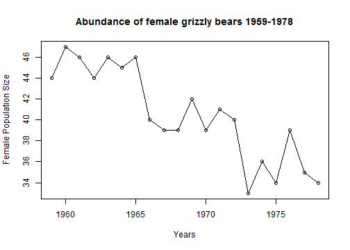

% Assignment 2 - Grizzly Bear Population Viability Analysis
% Alexandre Camargo Martensen
% Januray 18, 2014

## Question 1
1. (10 points) Plot the abundance of female grizzly bears through time. Use open circles as your symbol on the plot and connect the symbols with a line. Remember to label your axes and include a figure caption. Hint: look up the plot, points, and lines functions. Describe in words the trends in abundance 1959-1978.


```r
gri <- -read.table("Grizzly.csv", header = TRUE, sep = ",")
gri <- gri * (-1)
names(gri)
```

```
## [1] "year" "N"
```


### Question 1 a. 


```r
plot(gri$year, gri$N, xlab = "Years", ylab = "Female Population Size")
title("Abundance of female grizzly bears 1959-1978")
lines(gri$year, gri$N)
```

 


### Question 1 b.
There is a general decreasing trend in female abundance between 1959 and 1978, altought with some variation (Figure 1). Nevertheless, there is a decrease of more than 10 females in this 20 years period. 


## Question 2
2. (10 points) Calculate the timeseries of annual population growth rates, rt=ln(Nt/Nt-1) for  Yellowstone grizzly bears. What is the mean population growth rate (approximate 95% Confidence  Intervals) for the period 1959 to 1978?


```r
rt.tot <- NULL
for (i in 2:length(gri$N)) {
    rt = log(gri$N[i]/gri$N[i - 1])
    rt.tot <- c(rt.tot, rt)
    i <- i + 1
}
rt.tot
```

```
##  [1]  0.06596 -0.02151 -0.04445  0.04445 -0.02198  0.02198 -0.13976
##  [8] -0.02532  0.00000  0.07411 -0.07411  0.05001 -0.02469 -0.19237
## [15]  0.08701 -0.05716  0.13720 -0.10821 -0.02899
```

```r
m <- mean(rt.tot)
```


```r
s <- sd(rt.tot)
n <- length(gri$N)
```


```r
hist(rt.tot)
```

 


```r
q <- quantile(rt.tot, probs = c(0.025, 0.975))
```


```r
plot(density(rt.tot), xlab = "r's", ylab = "", main = "Mean population growth rate between 1959 and 1978")
abline(v = m, col = "red")
abline(v = q[1], col = "blue")
abline(v = q[2], col = "blue")
text(0.01, 0.9, "Mean - red")
text(0.1, 0.5, "CI - blue")
text(-0.16, 0.5, "CI - blue")
```

 


The mean population growth rate is -0.0136 and its 95% confidence intervals are -0.1687 and 0.1146, respectively lower and higher ones. 

## Question 3
3. (15 points) A simple deterministic model for grizzly bear population dynamics is Nt+1=Nt*exp(r ), where r is the average population growth rate. Show (with equations, not simulations) how this model can be obtained from our calculation of the population growth rate. Using the mean population growth rate r, simulate the model for 50 years using an initial population size of 44. What is the final population size? Do it again and determine how long it will take the population to decline to 10 bears. Include a plot of the simulation.


### Question 3 a.
A population in time t+1 could be defined as:

                Nt+1 = Nt + B - D + I - E             Equation 1
            
  Where: N is population size, t is the time step, B is births, D is deaths, I immigration, and E emmigration. 
  
So, in this equation, we are saying that the population in t+1, is equal to the population in time t, plus the births, and the immigration, less the deaths and the emmigrations. 

So, the rate of change of the population, could be defined by:

            Nt+1 - Nt = Nt - Nt + B - D + I - E       Equation 2

            
                 Delta_N = B - D + I - E              Equation 3
                  
If we assume a closed population, we can assume that I and E are not considered, thus we have:

                      Delta_N = B - D                 Equation 4
                      
Considering population growth a continuous variable, which means that time (t) is infinitely small, we can describe population growth as a curve, and thus, as differential equation (dN/dt).

The differential equation in this case (dN/dt) refers to the difference in population size (dN) measured in a very small time interval (dt). And in this case, to any time step t, the population growth is given by the slope of the tangent line in time step t (Figure 4, 5a and b).


```r
plot(gri$year, gri$N, xlab = "Years", ylab = "Female Population Size")
title("Abundance of female grizzly bears 1959-1978")
lines(spline(gri$year, gri$N))
x <- c(41, 1968)
y <- c(1969, 43)
lines(x, y, col = "red")
```

 


```r
par(mfrow = c(1, 2))
plot(gri$year, gri$N, xlab = "Years", ylab = "Female Population Size", xlim = c(1964.5, 
    1966), ylim = c(42, 47), type = "n", xaxt = "n")
title("Zoom in in the abundance graph")
lines(spline(gri$year, gri$N), lwd = 3)
axis(1, label = 1964, 1964)
axis(1, label = 1965, 1965)
axis(1, label = 1966, 1966)
axis(2)
x <- c(80, 1968)
y <- c(1969, 43)
lines(x, y, col = "red", lwd = 5)

curve(sin, -2 * pi, 2 * pi, xlim = c(-4.8, -3.8), ylim = c(0.5, 1.15), xaxt = "n", 
    yaxt = "n", xlab = "Time", ylab = "Number of Females")
title("Example of the slope of the tangent")
xs1 <- c(-4.8, -4.2)
ys1 <- c(1.05, 0.9)
lines(xs1, ys1, col = "red", lwd = 3)

xs2 <- c(-4.55, -4.55)
ys2 <- c(0.985, 0.93)

xs3 <- c(-4.36, -4.6)
ys3 <- c(0.94, 0.94)

lines(xs2, ys2, lty = 3)
lines(xs3, ys3, lty = 3)

text(-4.6, 0.965, expression(paste(Delta, "N")))
text(-4.45, 0.9, expression(paste(Delta, "t")))
text(-4.45, 1, "dN/dt")
```

 


So, the population growth rate, which is a measure of the changes in population size (dN), is measured in a very small time interval (dt), and in closed populations, is a function of the births (B) and the deaths (D), as shown in he equation above (Equation 4).

Since birth rates and death rates are both functions of population size, thus we have:

                          B = bN  and D = dN        Equation 5 and 6
        
    Where: b is instantaneous (i.e. the very short time step mentioned above) 
    per capita birth rate, and d is instantaneous per capita death rate.
    
Thus, getting back to equation 4, we have:

                          dN/dt = (b - d) * N       Equation 7
                          
So, the difference between births and deaths, multiplied by the population size in time 0, in closed populations, gives the population growth rate in time 1.

So, as (b - d) = r, we can get to the following equation:

                          dN/dt = r * N             Equation 8

Thus, when b > d, r > 0, and the population increase in size, since the population growth rate is positive (r > 0). From another side, when b < d, r < 0 (negative population growth rate), and thus, population decrease in size. Finally, when b = d, r = 0, thus, population growth rate is zero, and population size stills the same.

Integrating the equation 8 we reach an equation that projects future population size (Equation 9).

For more information in how to integrate the differential equation above:

http://www.ugrad.math.ubc.ca/coursedoc/math101/notes/moreApps/separable.html


                          Nt+1=Nt*exp(r)            Equation 9

### Question 3 b.
Simulations:


```r
m <- mean(rt.tot)
r <- m

ini.pop <- 44
res <- 44

for (yr in 2:50) {
    pop <- ini.pop * (exp(r))
    ini.pop <- pop
    res <- c(res, pop)
}

res[50]
```

```
## [1] 22.63
```

```r
round(res[50])
```

```
## [1] 23
```


The population size in the 50th year is 22.62967 , and the rounded population size is 23.


```r
par(mfrow=c(1, 2))
plot(res, xlab="Years", ylab="Number of individuals")
title("Results of the simulations of the # of individuals")

plot(round(res), xlab="Years", ylab="Round number of individuals", 
     
     sub="Rounded since we do not have half individuals")
title("Rounded results of the simulations")
```

 


### Question 3 c.

```r
ini.pop <- 44
ini.pop.c <- 44
res <- 44

while (ini.pop.c >= 10) {
    pop <- ini.pop * (exp(r))
    ini.pop <- pop
    ini.pop.c <- round(pop)
    res <- c(res, pop)
}

length(res)
```

```
## [1] 114
```

```r
res
```

```
##   [1] 44.000 43.407 42.822 42.245 41.675 41.114 40.559 40.013 39.474 38.941
##  [11] 38.417 37.899 37.388 36.884 36.387 35.897 35.413 34.935 34.465 34.000
##  [21] 33.542 33.090 32.644 32.204 31.770 31.341 30.919 30.502 30.091 29.686
##  [31] 29.285 28.891 28.501 28.117 27.738 27.364 26.996 26.632 26.273 25.919
##  [41] 25.569 25.225 24.885 24.549 24.218 23.892 23.570 23.252 22.939 22.630
##  [51] 22.325 22.024 21.727 21.434 21.145 20.860 20.579 20.302 20.028 19.758
##  [61] 19.492 19.229 18.970 18.714 18.462 18.213 17.968 17.725 17.487 17.251
##  [71] 17.018 16.789 16.563 16.339 16.119 15.902 15.688 15.476 15.268 15.062
##  [81] 14.859 14.659 14.461 14.266 14.074 13.884 13.697 13.512 13.330 13.151
##  [91] 12.973 12.798 12.626 12.456 12.288 12.122 11.959 11.798 11.639 11.482
## [101] 11.327 11.174 11.024 10.875 10.729 10.584 10.441 10.301 10.162 10.025
## [111]  9.890  9.756  9.625  9.495
```

```r
res.f <- cbind(1:length(res), res)
```

The number of years that will take to the population to decline to 10 bears is higher than 100 years, and it varies according to how do you round the number of bears. With 104 years the estimated bear population is 10.875195, and if you use floor ("round down"),  the population is already 10 bears. For 110 years the estimated population size is 10.024827 bears, and with 111 years the number of bears is 9.889710, and with 114 years it is 9.495186 bears. So, depending of how do you round the number of bears, the population could reach 10 individuals qith 104 years or 114 years. 


```r
plot(res, main = "Estimated number of bears", xlab = "Years", ylab = "Number of bears")
abline(h = 10, col = "red")
abline(v = 104, col = "blue")
abline(v = 114, col = "purple")
text(25, 13, "10 individuals limit", col = "red")
text(90, 40, "104 years", col = "blue")
text(100, 30, "114 years", col = "purple")
```

 


## Question 4
4. (15 points) A simple stochastic population model (via parametric bootstrap) for grizzly bear population dynamics is Nt+1 = Nt exp(rt), where rt is a single annual observation of the population growth rate drawn randomly (with replacement) from the set of annual population growth rates we calculated in (2). Conduct a stochastic simulation of the model over 50 years with initial population size of 44 bears using the rt estimates for the time period 1959 to 1978. The Include a plot of the simulation.


```r
ini.pop <- 44
res.1 <- 44

for (yr in 2:50) {
    pop <- ini.pop * (exp(sample(rt.tot, 1, replace = TRUE)))
    ini.pop <- pop
    res.1 <- c(res.1, pop)
}

res.1[50]
```

```
## [1] 28.97
```

```r
round(res.1[50])
```

```
## [1] 29
```


```r
plot(res.1, main = "Estimated number of bears with stochastic simulation", xlab = "Years", 
    ylab = "Number of bears")
abline(h = res.1[50])
lines(spline(res.1))
```

 


## Question 5
 5. (15 points) Suppose we set 10 bears as a critical minimum population size. We are interested in estimating the probability that the population will drop below this threshold over a time period of 50 years. Using the rt estimates for the time period 1959 to 1978 and an initial population size of 44, estimate this probability by conducting 1000 stochastic simulations of the model in 4 and counting the number of simulations where the population size dips below 10. Hint: you will need to use the ‘for’ and ‘if’ commands.


```r
gr <- NULL
for (sim in 1:1000) {
    ini.pop <- 44
    res.2 <- 44
    for (yr in 2:50) {
        pop <- ini.pop * (exp(sample(rt.tot, 1, replace = TRUE)))
        ini.pop <- pop
        res.2 <- c(res.2, pop)
        if (which.min(res.2) < 10) 
            b <- "below"
        if (which.min(res.2) > 10) 
            b <- "above"
    }
    gr <- c(gr, b)
}
table(gr)
```

```
## gr
## above below 
##   921    79
```


## Question 6
6. (15  points)  For	the	sets	of	1000	simulations	above,	calculate	the	average	final	 population	size	and	the	95%	confidence intervals	on	this	estimate	(Hint:	the	2.5   and	97.5 	percentiles	of	the	distribution	of	final	population	sizes	–	look up	the	function	quantile).


```r
fin.t <- NULL
for (sim in 1:1000) {
    ini.pop <- 44
    res.3 <- 44
    for (yr in 2:50) {
        pop <- ini.pop * (exp(sample(rt.tot, 1, replace = TRUE)))
        ini.pop <- pop
        res.3 <- c(res.3, pop)
        fin <- res.3[50]
    }
    fin.t <- c(fin.t, fin)
}
```


```r
plot(density(fin.t), main = "Average final population size and the 95% confidence intervals")
qf <- quantile(fin.t, probs = c(0.025, 0.975))
qf
```

```
##   2.5%  97.5% 
##  8.033 66.225
```

```r
abline(v = qf[1], col = "red")
abline(v = qf[2], col = "red")
```

 


## Question 7
7. (20  points)  Repeat	5	and	6	above	but	approximate	the	distribution	of	rt	with	a	 Normal	distribution	with	mean	and	standard	deviation	estimated	from	the	rt	values.	That	is,	the	model	is		 Nt+1	=	Nt*exp(r+εt)	where	r	is	the	mean	of	the	rt	values	and	εt	is	a	random	Normal	variable	with	 mean	zero	and	standard	deviation	estimated	from	the	rt	values.	Hint:	use	the	function	rnorm.	How	do	the	results	from	the	two	different	stochastic	models	 (7)	versus	(5)	compare?

### Question 7.a
7.a

```r
m <- mean(rt.tot)
s <- sd(rt.tot)
# Nt+1 = Nt*exp(r+εt)
gr.7 <- NULL
for (sim in 1:1000) {
    ini.pop <- 44
    res.7 <- 44
    for (yr in 2:50) {
        pop <- ini.pop * (exp(m + rnorm(1, mean = 0, sd = s)))
        ini.pop <- pop
        res.7 <- c(res.7, pop)
        if (which.min(res.7) < 10) 
            b <- "below"
        if (which.min(res.7) > 10) 
            b <- "above"
    }
    gr.7 <- c(gr.7, b)
}
table(gr.7)
```

```
## gr.7
## above below 
##   940    60
```

```r

comp <- data.frame(cbind(t(t(table(gr))), t(t(table(gr.7)))))

names(comp) <- c("ex.5", "ex.7")
comp.f <- t(comp)
comp.f
```

```
##      above below
## ex.5   921    79
## ex.7   940    60
```

```r
comp.m <- as.matrix(comp.f)
ch.1 <- chisq.test(comp.m, simulate.p.value = TRUE, B = 2000)
ch.1
```

```
## 
## 	Pearson's Chi-squared test with simulated p-value (based on 2000
## 	replicates)
## 
## data:  comp.m
## X-squared = 2.791, df = NA, p-value = 0.1294
```

```r

if (ch.1$p.value < 0.05) RR.7a <- ("They are different")
if (ch.1$p.value > 0.05) RR.7a <- ("They are equal, both distributions generate similar results")

RR.7a
```

```
## [1] "They are equal, both distributions generate similar results"
```


### Question 7.b

```r
fin.t.7b <- NULL
for (sim in 1:1000) {
    ini.pop <- 44
    res.7b <- 44
    for (yr in 2:50) {
        pop <- ini.pop * (exp(m + rnorm(1, mean = 0, sd = s)))
        ini.pop <- pop
        res.7b <- c(res.7b, pop)
        fin.7b <- res.7b[50]
    }
    fin.t.7b <- c(fin.t.7b, fin.7b)
}

fin.t.df <- data.frame(fin.t)
fin.t.7b.df <- data.frame(fin.t.7b)
fin.F <- cbind(fin.t.df, fin.t.7b.df)
names(fin.F) <- c("ex.6", "ex.7")
head(fin.F)
```

```
##     ex.6  ex.7
## 1  8.852 10.46
## 2 16.651 31.80
## 3 33.927 21.56
## 4 31.482 40.17
## 5 29.664 20.81
## 6 63.616 14.48
```

```r
tt <- t.test(fin.t.df, fin.t.7b.df)


if (tt$p.value < 0.05) RR.7b <- ("They are different")
if (tt$p.value > 0.05) RR.7b <- ("They are equal, both distributions generate similar results")
RR.7b
```

```
## [1] "They are equal, both distributions generate similar results"
```


### Question 7.c
How do the results from the two different stochastic models (7) versus (5) compare?


-------
This report was generated with [R](http://www.r-project.org/) (3.0.2) and [pander](https://github.com/rapporter/pander) (0.3.8) on x86_64-w64-mingw32 platform.